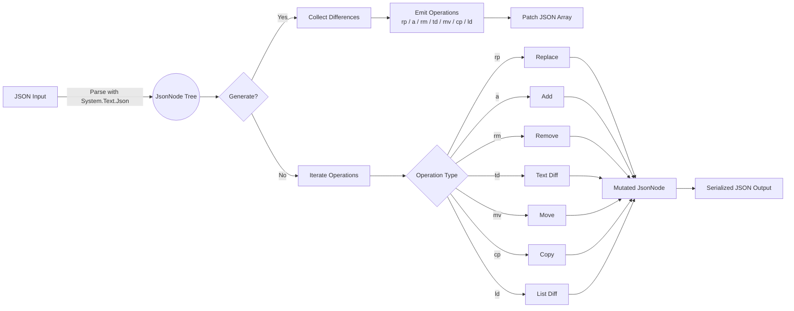

# JSONMorph

JSONMorph is a lightweight .NET library for generating and applying JSON patches. It focuses on predictable output, culture-invariant number formatting, and a compact operation format well-suited for messaging scenarios.

## TL;DR Benefits
- Shrink storage and bandwidth footprints: JSONMorph emits patches that are frequently 5-15x smaller than resending full JSON documents, cutting annual storage from roughly 36 GB to 3.4 GB in a 500-articles-per-day newsroom example.
- Keep diffs predictable with invariant serialization and deterministic operation ordering.
- Stay productive with a focused surface area: `GeneratePatch` and `ApplyPatch` handle round-trips without ceremony.

## Why JSONMorph?
- **Deterministic output** – invariant serialization keeps patches stable across locales.
- **Minimal allocations** – built on top of `System.Text.Json` and `JsonNode` so round-trips stay fast.
- **Simple surface** – a single static class with `GeneratePatch` and `ApplyPatch` helpers.
- **Battle-tested** – comprehensive unit tests cover primitive values, nested objects, arrays, and error paths.

## Installation

```pwsh
# Once the package is published to NuGet.org
dotnet add package JSONMorph
```

You can also add the package reference directly to your project file:

```xml
<ItemGroup>
  <PackageReference Include="JSONMorph" Version="1.0.0" />
</ItemGroup>
```

## Quick Start

```csharp
using JSONMorph;

string original = """
{
  "name": "John",
  "skills": ["csharp", "sql"]
}
""";

string updated = """
{
  "name": "Jane",
  "skills": ["csharp", "azure", "sql"],
  "title": "Senior Engineer"
}
""";

string patch = JsonMorph.GeneratePatch(original, updated);
string patched = JsonMorph.ApplyPatch(original, patch);

Console.WriteLine(patch);
```

The generated patch uses these operation codes:

| Operation | Code | Description |
| --------- | ---- | ----------- |
| Replace   | `rp` | Replace the value at a path. |
| Text Diff | `td` | Apply an in-place diff to a string by specifying a start index, delete length, and inserted text. |
| Add       | `a`  | Add a value at a path. Can append to arrays or set object properties. |
| Remove    | `rm` | Remove the value at a path. |
| Move      | `mv` | Relocate a value from the `from` path to `path` without cloning. |
| Copy      | `cp` | Clone the value at `from` and insert it at `path`. |
| List Diff | `ld` | Apply one or more in-array move operations described by a compact payload. |

`GeneratePatch` automatically chooses between text diffs, moves, list diffs, and full replacements to produce the smallest serialized patch for a change.

## Interpreting Paths

Paths follow the [JSON Pointer](https://www.rfc-editor.org/rfc/rfc6901) syntax. Segments are escaped with `~0` for tilde (`~`) and `~1` for slash (`/`). Array indices are zero-based.

## Working With Patches

- `GeneratePatch` returns an indented JSON array representing the operations needed to transform the original document into the modified document.
- `ApplyPatch` consumes the patch array and returns a formatted JSON string containing the patched document.
- Text diff operations (`td`) only target string values. The payload uses compact keys (`s`, `dl`, `it`) and follows this structure:

  ```json
  {
    "s": 5,
    "dl": 3,
    "it": "abc"
  }
  ```

Both methods throw `ArgumentException` if the supplied JSON cannot be parsed and `InvalidOperationException` for unsupported or malformed operations.

## How JSONMorph Differs from RFC 6902

JSONMorph borrows the idea of JSON Pointer paths from the standard, but it intentionally diverges to favor small payloads and deterministic behavior:
- Short op codes (`rp`, `rm`, `mv`, etc.) keep patches compact for messaging systems compared to the longer `replace`, `remove`, `move` verbs in RFC 6902.
- Compact member names (`p`, `v`, `f`, `s`, `dl`, `it`, `m`) reduce message size beyond what shorter op codes provide.
- Text diffs (`td`) apply character-level edits to strings with the `s`/`dl`/`it` payload, avoiding whole-value replacements when a headline or paragraph changes slightly. RFC 6902 replaces the entire string.
- List diffs (`ld`) bundle multiple in-array moves into a single instruction when it serializes smaller than separate move operations. The standard has no aggregate list-diff primitive.
- Adds are context-aware: inserting into an existing array property without an index appends by default, whereas RFC 6902 requires pointing directly at the array index.
- Patches are emitted with deterministic formatting (`System.Text.Json` + invariant culture) so the exact text stays stable across machines.
- Copy (`cp`) and move (`mv`) mirror RFC 6902 intent but rely on compact codes and the `f` pointer field; the standard's `test` operation is intentionally omitted to keep the surface minimal.

Consumers integrating with RFC 6902 endpoints should continue to use the standard patch format. JSONMorph targets scenarios where both producer and consumer rely on the same lightweight contract and benefit from string-level diffs.

### Internal Flow



## Documentation

In-depth guides live in the `docs/` folder:

- [Getting Started](docs/getting-started.md)
- [Patch Format](docs/patch-format.md)
- [Development Guide](docs/development.md)

## Contributing

We welcome contributions! Please read the [contributing guide](CONTRIBUTING.md), follow the [code of conduct](CODE_OF_CONDUCT.md), and review current tasks on the issue tracker before opening a pull request.

## Release Checklist

See [docs/release-checklist.md](docs/release-checklist.md) for the steps we follow prior to publishing a new version.

## Security

If you discover a security vulnerability, please reach out before opening a public issue. Details are available in [SECURITY.md](SECURITY.md).

## License

JSONMorph is licensed under the MIT license. See [LICENSE](LICENSE).
